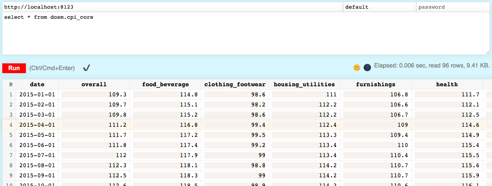

# opendosm-clickhouse

Access [OpenDOSM](https://open.dosm.gov.my/) (Department of Statistics Malaysia) data from ClickHouse.

## How it works

OpenDOSM provides public GCS buckets where you can download the dataset as CSV or Parquet files.
This project uses [dbt](https://docs.getdbt.com/) to pull these files into [ClickHouse](https://clickhouse.com/) so that you can interact with it using SQL.

## Why?

Mostly for fun. I work as a data engineer, and this is the kind of things I do at work.
Besides that, the data can be used for various purposes, e.g. as training set for quantitative economics models.

## Usage

You need to have Docker installed.

Run:

```sh
scripts/start.sh
```

Then go to http://localhost:8123/play?user=default#c2VsZWN0ICogZnJvbSBkb3NtLmNwaV9jb3Jl.



Or use `clickhouse-client`:

```sh
$ docker compose exec clickhouse-server clickhouse-client

ClickHouse client version 23.1.3.5 (official build).
Connecting to localhost:9000 as user default.
Connected to ClickHouse server version 23.1.3 revision 54461.

Warnings:
 * Linux is not using a fast clock source. Performance can be degraded. Check /sys/devices/system/clocksource/clocksource0/current_clocksource

a077a96c66c7 :) select * from dosm.cpi_core

SELECT *
FROM dosm.cpi_core

Query id: d882e59d-335f-44f5-b5a8-c607d36aee40

┌───────date─┬────────────overall─┬──────food_beverage─┬─clothing_footwear─┬──housing_utilities─┬────────furnishings─┬─────────────health─┬──────────transport─┬─────communication─┬─recreation_culture─┬──────────education─┬────────hospitality─┬───────────────misc─┐
│ 2015-01-01 │              109.3 │              114.8 │              98.6 │                111 │              106.8 │              111.7 │              104.8 │              97.2 │              105.3 │              111.1 │              118.6 │              106.2 │
│ 2015-02-01 │              109.7 │              115.1 │              98.2 │              112.2 │              106.6 │              112.1 │              104.9 │              97.2 │              105.7 │              111.7 │              118.8 │              106.7 │
...
│ 2022-12-01 │              127.2 │              146.1 │              93.4 │              130.1 │              124.4 │              126.3 │              119.8 │              97.4 │              115.6 │              122.9 │              143.9 │              119.9 │
└────────────┴────────────────────┴────────────────────┴───────────────────┴────────────────────┴────────────────────┴────────────────────┴────────────────────┴───────────────────┴────────────────────┴────────────────────┴────────────────────┴────────────────────┘

96 rows in set. Elapsed: 0.007 sec.
```

You can also use Grafana at http://localhost:3000 to visualize the data.


To list all tables:

```sql
SHOW TABLES FROM dosm
```
